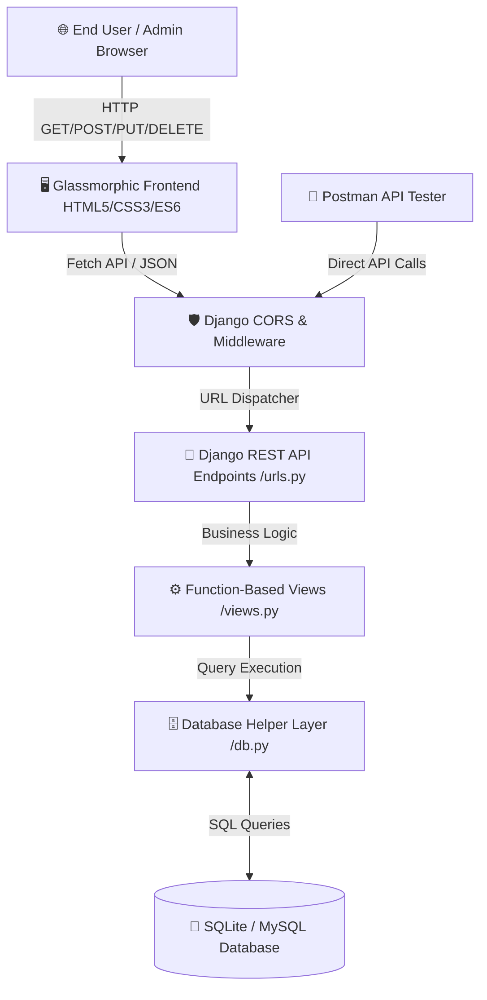

<div align="center">

# 🏝️ Island Booking System (IBS) 🌊

[](https://www.djangoproject.com/)
[](https://www.python.org/)
[](https://developer.mozilla.org/en-US/docs/Web/JavaScript)
[](https://www.postman.com/)
[](https://www.sqlite.org/)
[](https://github.com/mannamyagneswari14/useState)

<p align="center">
  <b>An Ultra-Premium, Full-Stack Island Vacation & Resort Booking Management Platform</b>
  <br />
  <i>Powered by Django REST APIs, Custom Ocean Glassmorphic UI, & Real-Time Financial Invoicing</i>
</p>

---

[📖 Overview](#-project-overview) •
[🏗️ Architecture](#-system-architecture) •
[📡 API Reference](#-complete-rest-api-documentation-20-endpoints) •
[📂 File Structure](#-project--package-structure) •
[🖼️ Visual Showcase](#-project-visual-showcase) •
[🚀 Quick Start](#-installation--execution-guide) •
[🤝 Collaborators](#-collaborators--contributing)

</div>

---

## 📌 Project Overview

**Island Booking System (IBS)** is an enterprise-grade, full-stack vacation management platform built for modern travel agencies and resort providers. It features a dual-facing architecture catering to both **End Travelers** and **Platform Administrators**.

### 🌟 Key Platform Features

- 🏝️ **Island Destinations Explorer**: Live search filtering, weather/climate indicators, best visiting seasons, and high-res imagery.
- 🏨 **Resort & Tariff Packages**: Curated island stays ranging from Overwater Luxury Bungalows to Caldera View Villas.
- 🧮 **Dynamic Cost Calculator**: Instant real-time price calculations based on traveler count, duration, and selected resort services.
- 💳 **Checkout & Payment Gateway Simulation**: Instant transaction ledger entries with unique reference tokens (`TXN...`).
- 📊 **Customer Dashboard**: Historical booking timeline, payment status tracking, and downloadable travel receipts.
- 🔐 **Admin Control Panel**: Complete full-stack CRUD interface for Customer accounts, Destinations, Packages, Reservations, and Revenue.
- 🔌 **20 Standard RESTful Endpoints**: Full CORS enabled for cross-platform integration (Web, Mobile, Postman).

---

## 🤝 Collaborative Repositories

- 🐙 **Repository 1**: [mannamyagneswari14/useState](https://github.com/mannamyagneswari14/useState)
- 🐙 **Repository 2**: [hemanthc29/Island-Booking-System](https://github.com/hemanthc29/Island-Booking-System)

---

## 🏗️ System Architecture



---

## 📡 Complete REST API Documentation (20 Endpoints)

All endpoints accept and return `Content-Type: application/json`. CORS is enabled for all domain origins (`*`).

### 👤 1. Customers Module
| Method | Endpoint Route | Description | Request Body Example |
| :---: | :--- | :--- | :--- |
| `GET` | `/customers/` | Fetch all registered customer profiles | None |
| `POST` | `/customers/add/` | Register a new customer | `{"full_name": "Rahul Sharma", "email": "rahul@gmail.com", "phone": "9876543210", "nationality": "Indian", "password": "rahul"}` |
| `PUT` | `/customers/update/<id>/` | Update existing customer details | `{"full_name": "Rahul Verma", "email": "rahul@gmail.com", "phone": "9876543210", "nationality": "Indian", "password": "pass"}` |
| `DELETE` | `/customers/delete/<id>/` | Remove a customer account | None |

### 🏝️ 2. Islands Module
| Method | Endpoint Route | Description | Request Body Example |
| :---: | :--- | :--- | :--- |
| `GET` | `/islands/` | List all island destinations | None |
| `POST` | `/islands/add/` | Create a new island destination | `{"island_name": "Bora Bora", "country": "French Polynesia", "description": "Lagoon & overwater stays", "climate": "Tropical", "best_season": "May to Oct", "image_url": "https://..."}` |
| `PUT` | `/islands/update/<id>/` | Update island destination record | `{"island_name": "Maldives Atoll", "country": "Maldives", "description": "Coral reefs", "climate": "Tropical", "best_season": "Nov to Apr", "image_url": "https://..."}` |
| `DELETE` | `/islands/delete/<id>/` | Delete an island destination | None |

### 🏖️ 3. Resort Packages Module
| Method | Endpoint Route | Description | Request Body Example |
| :---: | :--- | :--- | :--- |
| `GET` | `/packages/` | Get all resort vacation packages | None |
| `POST` | `/packages/add/` | Add a new vacation package | `{"island_name": "Maldives", "resort_name": "Soneva Jani", "package_name": "Luxury Escape", "duration": "5 Days", "price": 3500.00, "included_services": "Spa, Meals"}` |
| `PUT` | `/packages/update/<id>/` | Modify resort package details | `{"island_name": "Maldives", "resort_name": "Velaa", "package_name": "Honeymoon Villa", "duration": "7 Days", "price": 4999.00, "included_services": "Butler, Seaplane"}` |
| `DELETE` | `/packages/delete/<id>/` | Delete a resort package | None |

### 📅 4. Bookings Module
| Method | Endpoint Route | Description | Request Body Example |
| :---: | :--- | :--- | :--- |
| `GET` | `/bookings/` | Retrieve all customer reservations | None |
| `POST` | `/bookings/add/` | Create a new trip reservation | `{"customer_name": "Rahul Sharma", "island_name": "Maldives", "package_name": "Luxury Escape", "travel_date": "2026-08-20", "number_of_people": 2, "total_amount": 7000.00, "booking_status": "Confirmed"}` |
| `PUT` | `/bookings/update/<id>/` | Update reservation schedule/status | `{"customer_name": "Rahul Sharma", "island_name": "Maldives", "package_name": "Luxury Escape", "travel_date": "2026-09-01", "number_of_people": 3, "total_amount": 10500.00, "booking_status": "Confirmed"}` |
| `DELETE` | `/bookings/delete/<id>/` | Cancel & remove reservation | None |

### 💳 5. Payments Module
| Method | Endpoint Route | Description | Request Body Example |
| :---: | :--- | :--- | :--- |
| `GET` | `/payments/` | Fetch transaction financial ledger | None |
| `POST` | `/payments/add/` | Log new transaction payment | `{"booking_id": 1, "customer_name": "Rahul Sharma", "amount": 7000.00, "payment_method": "Credit Card", "payment_status": "Success", "transaction_id": "TXN123456789", "payment_date": "2026-07-17"}` |
| `PUT` | `/payments/update/<id>/` | Update payment ledger record | `{"booking_id": 1, "customer_name": "Rahul Sharma", "amount": 7000.00, "payment_method": "UPI", "payment_status": "Success", "transaction_id": "TXN123456789", "payment_date": "2026-07-17"}` |
| `DELETE` | `/payments/delete/<id>/` | Remove payment record | None |

---

## 📂 Project & Package Structure

```
IslandBookingSystem/
│
├── ⚙️ Backend/                         # Django REST API Engine
│   ├── db.py                           # Database Access Object (DAO) & SQL queries
│   ├── db.sqlite3                      # SQLite production database
│   ├── island_booking.db               # Supplementary SQLite database file
│   ├── manage.py                       # Django CLI execution controller
│   ├── seed_db.py                      # Automated database table seeder & mock data
│   ├── settings.py                     # Project configuration & CORS policy definitions
│   ├── urls.py                         # Route definitions for 20 REST API endpoints
│   ├── views.py                        # CORS-wrapped JSON response handlers
│   └── wsgi.py                         # WSGI Web Application Server interface
│
├── 🖥️ Frontend/                        # Client UI Application
│   ├── index.html                      # Landing & Hero Showcase Page
│   ├── login.html                      # Authentication Sign-In Page
│   ├── register.html                   # New Customer Account Creation Form
│   ├── islands.html                    # Island Catalog & Live Search Filter
│   ├── packages.html                   # Resort Package Cards & Price Plans
│   ├── booking.html                    # Dynamic Cost Calculator & Trip Reservation
│   ├── payment.html                    # Checkout Gateway Simulation
│   ├── customer_dashboard.html         # User Invoices & Booking Ledger
│   ├── admin_dashboard.html            # Admin Control Panel (Full CRUD Tables)
│   ├── style.css                       # Custom Ocean Glassmorphism Design System
│   └── script.js                       # Vanilla ES6 Fetch API Integration & LocalStorage state
│
├── 🎨 assets/                          # HD Screenshots & Documentation Media
│   ├── frontend_home.png               # Hero Landing Page View
│   ├── frontend_islands.png            # Island Destinations View
│   ├── frontend_packages.png           # Resort Packages View
│   ├── postman_api_testing.png         # Postman API Execution View
│   ├── vscode_codebase.png             # Development Workspace View
│   └── mysql_database_screenshot.png   # Windows 11 Live MySQL Workbench Desktop View
│
├── 🚀 Island_Booking_System.postman_collection.json  # Exported Postman v2.1 API Spec
└── 📖 README.md                        # Master Project Documentation
```

---

## 🖼️ Project Visual Showcase

<div align="center">

### 1. 🌐 Hero Landing Page
*Glassmorphic header, search bar, and island highlight carousel*
<br/>


<br/><br/>

### 2. 🏝️ Destination Catalog
*Interactive climate tags and seasonal travel indicators*
<br/>


<br/><br/>

### 3. 🏖️ Resort & Tariff Packages
*Curated vacation packages with included services breakdown*
<br/>


<br/><br/>

### 4. 📡 Postman API Testing
*Live verification of HTTP 200 OK responses across endpoints*
<br/>


<br/><br/>

### 5. 💻 VS Code Workspace
*Clean Django backend project architecture and route definitions*
<br/>


<br/><br/>

### 6. 🗄️ Live MySQL Workbench Desktop (Windows 11 OS)
*Real-time SQL table execution showing financial payment ledger data*
<br/>


</div>

---

## ⚡ Installation & Execution Guide

### 1. ⚙️ Prerequisites
Ensure you have Python 3.10+ installed on your operating system:
```bash
python --version
pip install django
```

### 2. 🌱 Seed Testing Database
Initialize database schemas and insert sample records (Islands, Packages, Customers, Ledger):
```bash
cd Backend
python seed_db.py
```

### 3. 🚀 Launch REST API Backend Server
Start the Django HTTP API server listening on port `8000`:
```bash
python manage.py runserver 127.0.0.1:8000
```
> Server API URL: `http://127.0.0.1:8000/`

### 4. 🌐 Launch Frontend Application
In a separate terminal, serve the frontend on port `5000`:
```bash
cd Frontend
python -m http.server 5000 --bind 127.0.0.1
```
> Web Application URL: `http://127.0.0.1:5000/`

---

## 🔑 Demo Test Accounts

| Account Type | Email Address | Password | Privileges |
| :--- | :--- | :--- | :--- |
| 👑 **System Administrator** | `admin@ibs.com` | `admin123` | Full DB CRUD Access |
| 🧳 **Sample Customer** | `rahul@gmail.com` | `rahul123` | Bookings & Invoices |

---

<div align="center">
  <b>Made with ❤️ for PFSD Full-Stack Web Development</b>
  <br/>
  ⭐ <i>Star this repository if you find it helpful!</i> ⭐
</div>
