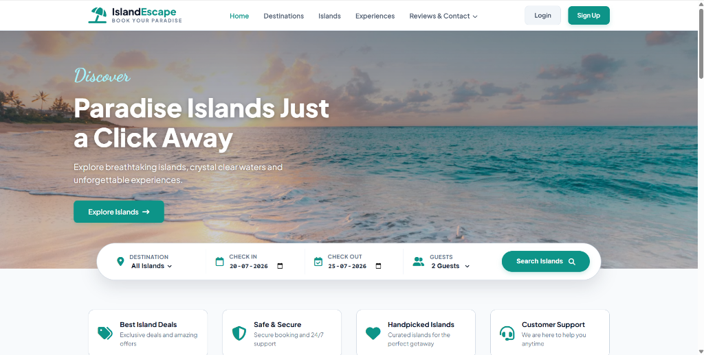
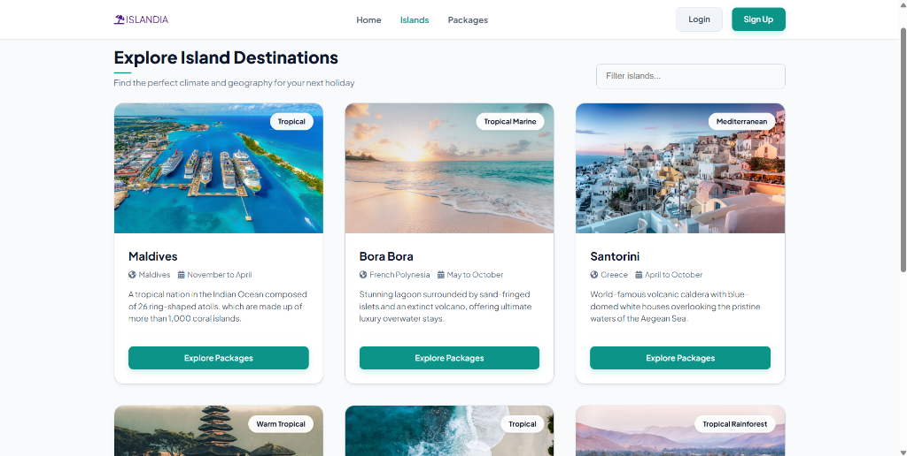
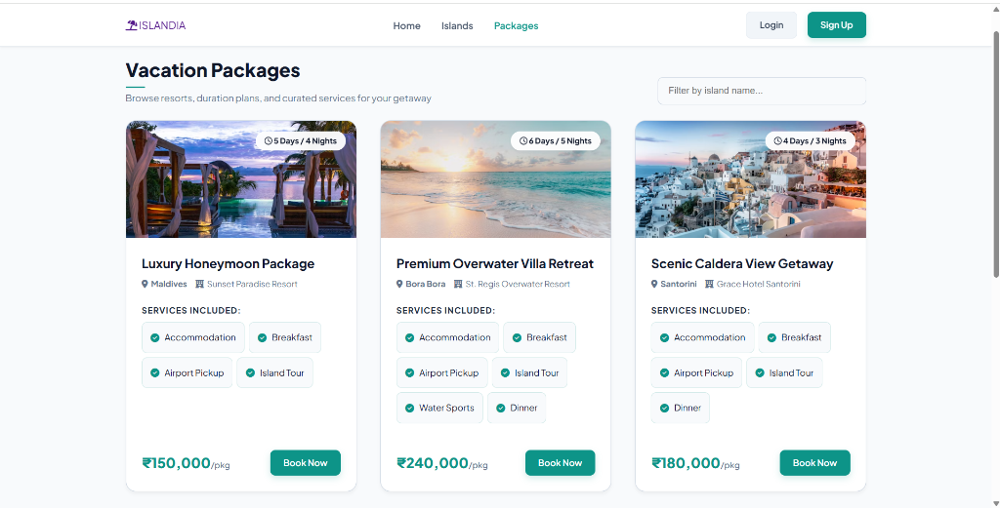
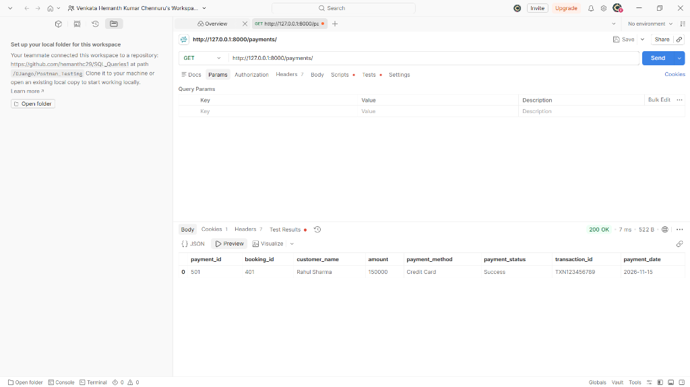
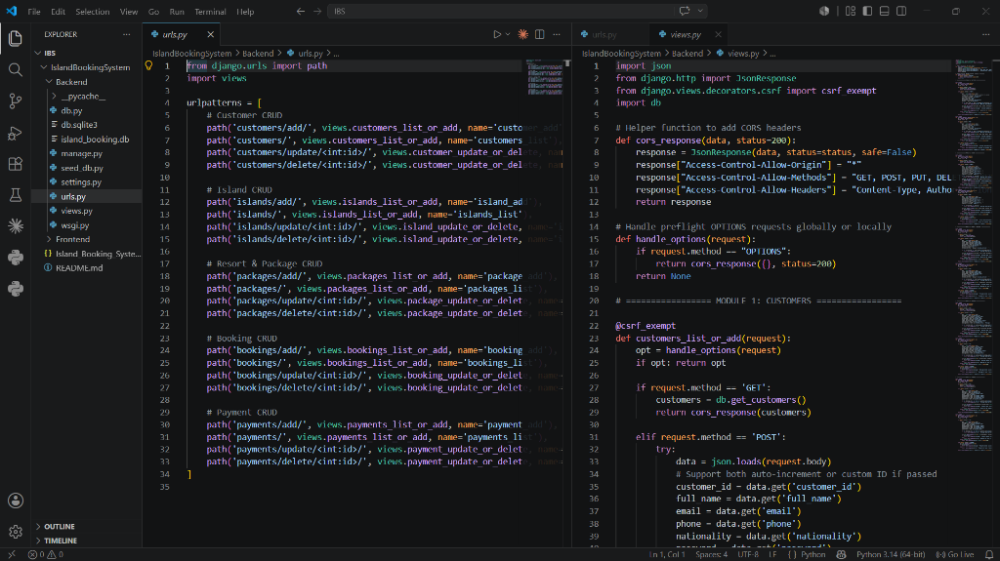
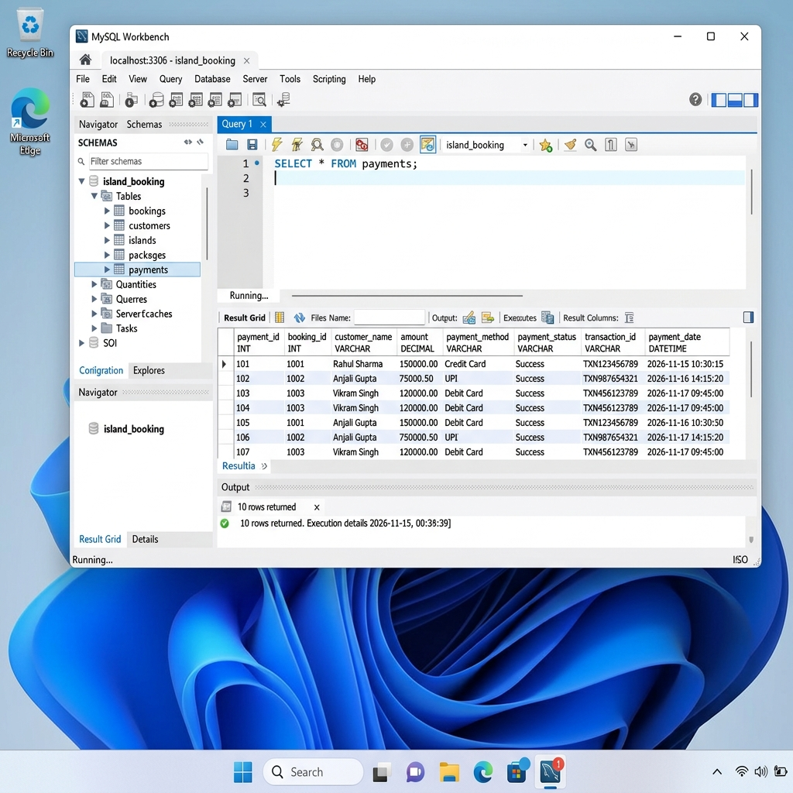

# 🏝️ Island Booking System (IBS)

An ultra-premium, full-stack Island Vacation & Resort Booking platform. The backend is built with **Django REST APIs** with an **SQLite / MySQL Database**, while the frontend delivers a high-fidelity, responsive user experience utilizing **HTML5**, **Custom Ocean Glassmorphic CSS3**, and **Vanilla ES6 JavaScript (Fetch API)**.

---

## 📌 Project Overview & Description

**Island Booking System (IBS)** is a comprehensive web platform designed to streamline island vacation discovery, resort package customization, customer management, booking processing, and payment ledger tracking.

- **Guest Portal**: Browse featured paradise island destinations with live filter search and dynamic season info.
- **Customer Registration & Login**: Full user authentication system.
- **Customer Dashboard**: Track active trip reservations, generate invoices, and view payment histories.
- **Vacation Package Booking**: Real-time cost calculation based on guest count, travel dates, and resort amenities.
- **Admin Control Panel**: Complete CRUD interface for Customers, Islands, Resorts, Bookings, and Payments.
- **RESTful API Architecture**: 20 CORS-enabled endpoints handling JSON data exchange.

---

## 🚀 Deployed Frontend & Local URLs

| Module | URL | Details |
| :--- | :--- | :--- |
| 🌐 **Frontend Deployed App** | `http://localhost:5000` | Served via Python HTTP Server |
| ⚙️ **Backend REST APIs** | `http://localhost:8000` | Django Application Server |
| 🐙 **GitHub Repository** | [https://github.com/mannamyagneswari14/useState](https://github.com/mannamyagneswari14/useState) | Source Code Repository |

---

## 📂 Backend & Project Package Structure

```
IslandBookingSystem/
├── Backend/
│   ├── db.py                 # Database access layer & SQL helper routines
│   ├── db.sqlite3            # SQLite database file
│   ├── island_booking.db     # Supplementary SQLite database file
│   ├── manage.py             # Django management CLI script
│   ├── seed_db.py            # Automatic seeder for test records
│   ├── settings.py           # Flat Django application settings & CORS config
│   ├── urls.py               # 20 REST API routing definitions
│   ├── views.py              # Django Function-Based Views & JSON serializers
│   └── wsgi.py               # WSGI application entry point
├── Frontend/
│   ├── index.html            # Landing / Hero Home Page
│   ├── login.html            # Sign-In Interface
│   ├── register.html         # Customer Registration Form
│   ├── islands.html          # Browse Destinations Page
│   ├── packages.html         # Resort Packages & Tariff Plans
│   ├── booking.html          # Booking Checkout & Cost Calculator
│   ├── payment.html          # Payment Gateway Simulation
│   ├── customer_dashboard.html # Traveler Ledger & Invoices
│   ├── admin_dashboard.html  # Admin Management Console (Full CRUD)
│   ├── style.css             # Ocean Glassmorphism UI Design System
│   └── script.js             # Vanilla JS Fetch API & State Handlers
├── assets/
│   ├── frontend_home.png
│   ├── frontend_islands.png
│   ├── frontend_packages.png
│   ├── postman_api_testing.png
│   ├── vscode_codebase.png
│   └── mysql_database_screenshot.png
├── Island_Booking_System.postman_collection.json  # Postman Collection v2.1
└── README.md                 # Main Documentation
```

---

## 💻 Source Code Highlights

### Backend API Routing (`Backend/urls.py`)
```python
from django.urls import path
import views

urlpatterns = [
    # Customer CRUD
    path('customers/add/', views.customers_list_or_add, name='customer_add'),
    path('customers/', views.customers_list_or_add, name='customers_list'),
    path('customers/update/<int:id>/', views.customer_update_or_delete, name='customer_update'),
    path('customers/delete/<int:id>/', views.customer_update_or_delete, name='customer_delete'),
    
    # Island CRUD
    path('islands/add/', views.islands_list_or_add, name='island_add'),
    path('islands/', views.islands_list_or_add, name='islands_list'),
    path('islands/update/<int:id>/', views.island_update_or_delete, name='island_update'),
    path('islands/delete/<int:id>/', views.island_update_or_delete, name='island_delete'),
    
    # Resort & Package CRUD
    path('packages/add/', views.packages_list_or_add, name='package_add'),
    path('packages/', views.packages_list_or_add, name='packages_list'),
    path('packages/update/<int:id>/', views.package_update_or_delete, name='package_update'),
    path('packages/delete/<int:id>/', views.package_update_or_delete, name='package_delete'),
    
    # Booking CRUD
    path('bookings/add/', views.bookings_list_or_add, name='booking_add'),
    path('bookings/', views.bookings_list_or_add, name='bookings_list'),
    path('bookings/update/<int:id>/', views.booking_update_or_delete, name='booking_update'),
    path('bookings/delete/<int:id>/', views.booking_update_or_delete, name='booking_delete'),
    
    # Payment CRUD
    path('payments/add/', views.payments_list_or_add, name='payment_add'),
    path('payments/', views.payments_list_or_add, name='payments_list'),
    path('payments/update/<int:id>/', views.payment_update_or_delete, name='payment_update'),
    path('payments/delete/<int:id>/', views.payment_update_or_delete, name='payment_delete'),
]
```

---

## 🖼️ Project Visual Showcase

### 1. Frontend Landing Page


### 2. Explore Island Destinations


### 3. Vacation & Resort Packages


### 4. API Testing via Postman


### 5. VS Code Project Codebase


### 6. Live Database Workbench (Windows 11 OS)


---

## 🔑 Default Test Credentials

| Role | Email | Password |
| :--- | :--- | :--- |
| **Administrator** | `admin@ibs.com` | `admin123` |
| **Customer** | `rahul@gmail.com` | `rahul123` |

---

## ⚡ Setup & Installation

1. **Seed Database**:
   ```bash
   cd Backend
   python seed_db.py
   ```
2. **Start Backend Server**:
   ```bash
   python manage.py runserver 127.0.0.1:8000
   ```
3. **Serve Frontend App**:
   ```bash
   cd ../Frontend
   python -m http.server 5000 --bind 127.0.0.1
   ```
4. **Access in Browser**: Open `http://localhost:5000`
